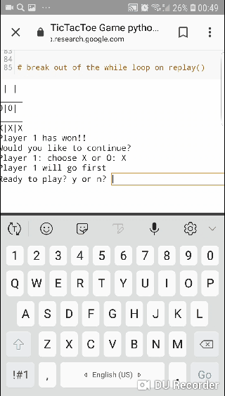

# TicTacToe in python3. A simple game in just simple 10 steps in google colab(jupiter) notebook
Run-and-play ready:))

https://github.com/ZackPashkin/TicTacToe-in-python3-.-A-simple-game-in-10-steps/blob/master/TicTacToe_Game_python3.ipynb

You can view it in colaboratory as well

Hope it will help you with learning python as it helped me! 
Original idea belongs to Jose Portilla, a great teacher or python.
I commented steps to highlight thoughts and logic of the game.
